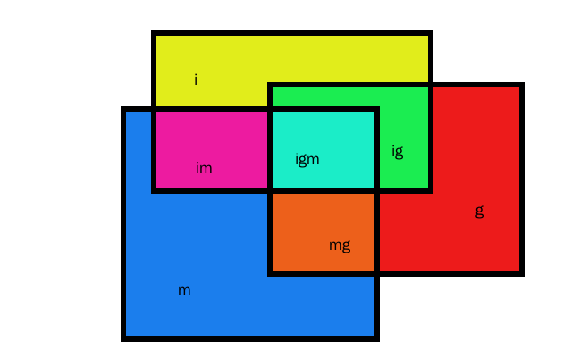

# 正则

<!-- toc -->

## 内置函数


### exec

exec 返回值属性为对象。

```js
var reg = /k/,
	str = 'kahn1990';
console.log(typeof reg.exec(str));
==> 'object'
```

其中共包含大约 (n+1) 个属性：index、input、数组。第三个属性为数组中的元素，匹配到一个则为 0，匹配到 n 个则为 (n-1)。

```js
var reg = /k/,
	str = 'kahn1990';
for( var key in reg.exec(str)){
	console.log('reg.exec(str)属性：'+key+'，其值为'+reg.exec(str)[key]+'；')
}
==> reg.exec(str)属性：index，其值为0；
==> reg.exec(str)属性：input，其值为kahn1990；
==> reg.exec(str)属性：0，其值为k；
==> undefined
```

在 exec 中设置 g 修饰符会更新正则表达式的 lastIndex 属性，表示本次匹配之后，下次匹配的索引从 lastIndex 开始。

```js
var reg = /k/,
	str = 'kahn1990';
console.log(reg.exec(str).index);
==> 0
console.log(reg.exec(str).index);
==> 0
var reg = /k/g,
	str = 'kahn1990';
console.log(reg.exec(str).index);
==> 0
console.log(reg.exec(str).index);
==> 1
```

### match

类似 exec，并同样具有 index 和 input 属性。

```js
var reg = /k/,
	str = 'kahn1990';
console.log(typeof str.match(reg));
==> 'object'
```

match 方法中 g 修饰符作用在完成匹配之后会继续匹配所有字符串直至结束，并且失去 index 和 input 属性。

### replace

replace 用于替换匹配到的字符串。

```js
var reg = /k/,
	str = 'kahn1990';
console.log(str.replace(reg, 'j');
==> 'jahn1990'
```

replace 方法中设置 g 修饰符之后会替换所有匹配的字符串。

```js
var reg = /9/,
	str = 'kahn1990';
console.log(str.replace(reg, '88');
==> 'kahn1880'
```

replace 函数中使用 $ 引用子正则表达式匹配内容。

```js
var reg = /（\w+)-(\w+)/,
	str = 'kahn1990-kangjian';
console.log(str.replace(reg, '$2-$2');
==> 'kangjian-kangjian'
```

在 replace 函数中 $ 符号有特殊含义，如果需要特意替换为 $ 符号需要使用 $$ 进行匹配。

### search

search 返回正则表达式第一次匹配的位置。

```js
var reg = /1/,
	str = 'kahn1990';
console.log(str.search(reg);
==> 4
```

### split

split 返回正则表达式第一次匹配的位置。

```js
var reg = /\W/,
	str = 'kahn1990-kangjian';
console.log(str.split(reg));
==> ["kahn1990", "kangjian"]
```

### test

test 检查 str 是否匹配成功，返回值为布尔类型。

```js
var reg = /k/,
	str = 'kahn1990';
console.log(typeof reg.test(str));
==> true
```

## RegExp

- new RegExp(patern[, flag])

对于`RegExp`对象，我在自己制作的html静态文件生成工具[^^kangcafe_github_io]上恰好有使用。

[^^kangcafe_github_io]:[kangcafe.github.io/app.js](https://github.com/kangcafe/kangcafe.github.io/blob/master/app.js):第255行`footnoteMap`参数附近。

```js
var content='this is ^footnote,^footnote:here!',
	reg = new RegExp("\\^+[a-zA-Z0-9_\u4e00-\u9fa5]+(?!:)", "igm");
console.log(content.match(reg,'g'));
==> ["^footnote"]
```

`flag` 参数由 "i"、"g"、"m"组合而成：



如上面我使用的`new RegExp("\\[\\^+[a-zA-Z0-9_\u4e00-\u9fa5]+\\](?!:)", "igm")`就是`igm`三项组合在一起。

| 模式匹配符 | 说明 |
|--------|--------|
|   i     |   ignorCase忽略大小写（不区分大小写）     |
|   m     |   mutiple允许多行匹配（搜索复数行）     |
|   g     |    globle进行全局匹配，指匹配到目标串的结尾（全文匹配）    |

除此之外还有另一种写法：

| 模式匹配符 | 说明 |
|--------|--------|
| new RegExp(patern[, flag]).ignorCase | 返回有没有指定 i选项 的布尔值 |
| new RegExp(patern[, flag]).source | 返回有没有指定 g选项 的布尔值 |
| new RegExp(patern[, flag]).global | 返回正则表达式部分的字符串 |

```js
var reg = new RegExp("\\[\\^+[a-zA-Z0-9_\u4e00-\u9fa5]+\\](?!:)", "igm");
console.log(reg.ignoreCase);
==> true
console.log(reg.global);
==> true
console.log(reg.source);
==> \[\^+[a-zA-Z0-9_一-龥]+\](?!:)
```

- RegExp.$

RegExp.$ 的形式与意义如下。

| 形式 | 意义 |
|--------|--------|
|RegExp.$n|第 n 个括号里的字符串。详细内容见后文。|
|RegExp.$&|等同于 RegExp.lastMatch 。|
|RegExp.$\`|等同于 RegExp.leftContext 。|
|RegExp.$"|等同于 RegExp.rightContext 。|
|RegExp.$+|等同于 RegExp.lastParen 。|
|RegExp.$_|等同于 RegExp.input 。|
|RegExp.$*|等同于 RegExp.multiline 。|


### 正则表达式语法


正则表达式可以用下面的形式来进行匹配。

| 正则表达式 | 意义 |
|--------|--------|
|A|字符A|
|ABC|字符串ABC|
|[ABC]|A、B、C其中一个字符|
|[A-C]|从A到C的其中一个字符|
|[^ABC]|不是A、B、C的任意一个字符|
|.|任意一个字符|
|A|匹配前面的子表达式零次或多次。例如，"AP" 能匹配 "A" 以及 "APP"。 * 等价于{0,}。|
|A+|匹配前面的子表达式一次或多次。例如，"AP+" 能匹配 "AP" 以及 "APP"，但不能匹配 "A"。+ 等价于 {1,}。|
|A?|匹配前面的子表达式零次或一次。例如，"do(es)?" 可以匹配 "do" 或 "does" 中的"do" 。? 等价于 {0,1}。|
|^A|以A开始的字符串|
|A$|以A结束的字符串|
|ABC&#124;DEF&#124;GHI|ABC或DEF或GHI|
|A{2}|2个A（AA）|
|A{2,}|2个以上A（AA、AAA、AAAA、...）|
|A{2,3}|2个～3个A（AA、AAA）|
|[\b]|退格|
|\b|匹配单词的边界|
|\B|\b以外的字符|
|\cA|Ctrl-A|
|\d|任意一个十进制数字（等同于 [0-9]）|
|\D|任意一个十进制以外的字符（等同于[^0-9]）|
|\f|换页符|
|\n|换行符|
|\r|回车|
|\s|任意一个空白字符（等同于[\f\n\r\t\v]）|
|\S|任意一个空白字符以外的一个字符|
|\t|制表符（TAB符）|
|\v|垂直制表符|
|\w|任意一个英文字母、数字或下划线（等同于 [A-Za-z0-9_]）|
|\W|任意一个英文字母、数字或下划线以外的字符|
|\2|匹配第2个 (...) 的字符串|
|\o033|8进制数033的字符|
|\x1b|16进制数1b的字符|

### 匹配

`RegExp`对象和其他几个正则相关函数如何关联使用。

| RegExp | 正则相关函数 | 实例 |
|--------|--------|--------|
| RegExp | exec | RegExp.exec([str]) |
| RegExp | match | str.match(RegExp) |

```js
var reg = new RegExp("[0-9]+");
console.log(reg.exec("abc123"));
==> ["123", index: 3, input: "abc123"]
console.log("abc123".match(reg));
==> ["123", index: 3, input: "abc123"]
console.log("abc123".match(/[0-9]+/));
==> ["123", index: 3, input: "abc123"]
```

- regexp.compile(patern[, flag])

把正则表达式预先编译为内部表达式以提高匹配的速度。

```js
var reg = new RegExp(""),
	str = "abc123";
reg.compile("[0-9]+");
console.log(str.match(reg));
==> ["123", index: 3, input: "abc123"]
```

- RegExp.input

把匹配字符串传递给`exec`函数。等同与`$_`。

```js
var reg = new RegExp("[0-9]+");
reg.input = "abc123";
console.log(reg.exec());
==> null
console.log(reg.exec(reg.input));
==> ["123"]
```

## 懒惰贪婪

贪婪匹配input标签
```js
<input(.*?)value="(.*?)"([^>]*?)>
```


## 常用正则

统一空格个数

```js
var reg = /\s+/g,
	str = 'k  a h  n   1  9  9    0';
console.log(str.replace(reg, ' '));
==> 'k a h n 1 9 9 0'
```

判断字符串是否由数字组成

```js
var reg = /^\d*$/,
	str = '13100888202';
console.log(reg.test(str));
==> true
```

电话号码正则

```js
var reg = /^\d{3,4}-\d{7,8}(-d{3,4})?$/,
	str = '0455-7711221';
console.log(reg.test(str));
==> true
```

手机号码正则

| 描述 | 正则 |
|--------|--------|
|国内13、15、18开头|^(13[0-9]&#124;14[5&#124;7]&#124;15[0&#124;1&#124;2&#124;3&#124;5&#124;6&#124;7&#124;8&#124;9]&#124;18[0&#124;1&#124;2&#124;3&#124;5&#124;6&#124;7&#124;8&#124;9])\\d{8}$|
|国内13、15开头|^0*(13&#124;15)\d{9}$|
|国内|^((13[0-9])&#124;(14[0-9])&#124;(15[0-9])&#124;(17[0-9])&#124;(18[0-9]))\d{8}$|

判断IE的版本

```js
^.*MSIE [5-8](?:\\.[0-9]+)?(?!.*Trident\\/[5-9]\\.0).*$
```

删除字符串两侧的空白字符

```js
var reg = /^\s+|\s+$/g,
	str = ' 131 ';
console.log(str.replace(reg,'').length);
==> 3
```

删除字符串左侧的空白字符

```js
var reg = /^\s+$/g,
	str = ' 131 ';
console.log(str.replace(reg,'').length);
==> 4
```

删除字符串右侧的空白字符

```js
var reg = /\s+$/g,
	str = ' 131 ';
console.log(str.replace(reg,'').length);
==> 4
```

### 身份证号码正则

| 描述| 正则 |
|--------|--------|
|校验身份证号码|(^\d{15}$)&#124;(^\d{17}([0-9]&#124;X&#124;x)$)|
|校验身份证号码|^(\d{14}&#124;\d{17})(\d&#124;[xX])$|
|校验身份证号码|d{15}&#124;d{18}|
|15位|^[1-9]\\d{7}((0\\d)&#124;(1[0-2]))(([0&#124;1&#124;2]\\d)&#124;3[0-1])\\d{3}$|
|18位|^[1-9]\\d{5}[1-9]\\d{3}((0\\d)&#124;(1[0-2]))(([0&#124;1&#124;2]\\d)&#124;3[0-1])\\d{3}([0-9]&#124;X)$|

### 文件相关

| 描述 | 正则 |
|--------|--------|
|匹配文本并指定行数|\S+?\s*?[\n\r]\S*?\S+?|
|去掉文件的后缀名|\.\w+$|
|验证文件路径和扩展名|^([a-zA-Z]\\:&#124;\\\\)\\\\([^\\\\]+\\\\)*[^\\/:*?"<>&#124;]+\\.txt(l)?$|

### 验证邮箱

| 正则 |
|--------|
|^([a-zA-Z0-9_-])+@([a-zA-Z0-9_-])+(\.[a-zA-Z0-9_-)+|
|^[a-zA-Z0-9][\w\.-]*[a-zA-Z0-9]@[a-zA-Z0-9][\w\.-]*[a-zA-Z0-9]\.[a-zA-Z][a-zA-Z\.]*[a-zA-Z]$|
|w+([-+.]w+)*@w+([-.]w+)*.w+([-.]w+)*|
|[&#92;&#92;w!#$%&'*+/=?^_`{&#124;}~-]+(?:\\.[&#92;&#92;w!#$%&'*+/=?^_`{&#124;}~-]+)*@(?:[&#92;&#92;w](?:[&#92;&#92;w-]*[&#92;&#92;w])?&#92;&#92;.)+[&#92;&#92;w](?:[&#92;&#92;w-]*&#91;&#92;&#92;w&#93;&#41;?|

尝试匹配input，之所以写着个正则，是因为想要做一个隐藏的input标签，埋在markdown文件里，效果不是很理想，记录待查。

```js
var reg = /<!--(.*)\s+md-uuid=(.*)?\s+>[\s\S+]*?-->/g;
reg.exec("<!-- <input value=footnote type=text md-uuid=hkh-k15- > -->")
==> ["<!-- <input value=footnote type=text md-uuid=hkh-k15- > -->", " <input value=footnote type=text", "hkh-k15-"]
reg.exec("<!-- <input value=footnote type=text id=md-uuid > -->pe=text id=md-uuid=hkh-k15- > -->")
==> null
var reg = /(\<\!\-\-)[\s+]*?<input(.*?)md-uuid=(.*)?\s+>[\s\S+]*?-->/g;
reg.exec("<!-- <input value=footnote type=text id=md-uuid > -->pe=text id=md-uuid=hkh-k15- > -->")
==> ["<!-- <input value=footnote type=text id=md-uuid > -->pe=text id=md-uuid=hkh-k15- > -->", "<!--", " value=footnote type=text id=md-uuid > -->pe=text id=", "hkh-k15-"]
```

看上去好像很难`贪婪`匹配到第一个`<!-- <input> -->`内的`md-uuid`值，所以改变思路，先匹配到`<!-- <input> -->`，然后徐徐图之。

```js
var regStr = /<!--\s<input\smd-uuid=[a-zA-Z0-9\-]+.+?>\s-->/g,
	regResult = regStr.exec('<!-- <input value=footnote type=text md-uuid=idnum876-id > -->pe=text id=md-uuid=hkh-k15- > -->'),
	fileNameUuid;
if (regResult && regResult.length > 0) {
	 var regMdUuidBox = /md-uuid=[a-zA-Z0-9\-]+/g;
	 var regMdUuidResult = regMdUuidBox.exec(regResult[0]);
	 if (regMdUuidResult && regMdUuidResult.length > 0) {
			 fileNameUuid = regMdUuidResult[0].replace(/\s/g, '').split('=')[1]
	 }
}
```

深度匹配括号内容[^^shendu_kuohao_sf]

[^^shendu_kuohao_sf]:[正则表达式匹配最里层括号的内容](https://segmentfault.com/q/1010000006080054?_ea=1016779):[中立生物 ](https://segmentfault.com/u/dfzy5566)在[segmentfaul](thttps://segmentfault.com)上提出了这个问题。

```js
var str1 = '(subject_id = "A" OR (status_id = "Open" AND (status_id = "C" OR level_id = "D")))';
console.log(str1.match(/\([^()]+\)/));
==> ["(status_id = "C" OR level_id = "D")"]
var str2 = '(subject_id = "A" OR subject_id = "Food" OR (subject_id = "C" OR (status_id = "Open" AND (status_id = "C" OR (level_id = "D" AND subject_id = "(Cat)")))))';
console.log(str2.match(/\([^()]*\"[^"]*\"[^()]*\)/));
==> ["(level_id = "D" AND subject_id = "(Cat)")"]
```

只含有汉字、数字、字母、下划线不能以下划线开头和结尾：

```js
var str = '54';
console.log(str.match(/^(?!_)(?!.*?_$)[a-zA-Z0-9_\u4e00-\u9fa5]+$/));
==> ["54"]
var str2 = '54_';
console.log(str.match(/^(?!_)(?!.*?_$)[a-zA-Z0-9_\u4e00-\u9fa5]+$/));
==> null
```

| 描述 | 正则 |
|--------|--------|
| 匹配中文 | [\u4e00-\u9fa5] |
| 英文字母 | [a-zA-Z] |
| 数字 | [0-9] |
| 至少一个汉字、数字、字母、下划线 | [a-zA-Z0-9_\u4e00-\u9fa5]+ |
|由数字、26个英文字母或下划线组成的字符串|^\\w+$|
| (?!.*?_$) | 不能以_结尾 |
| (?!_) | 不能以_开头 |
|匹配双字节字符(包括汉字在内)|[^x00-xff]|
|字符串仅能是中文|^[\\u4e00-\\u9fa5]{0,}$|

抽取网页中的颜色代码（Color Hex Codes）

```js
\\#([a-fA-F]|[0-9]){3,6}
```

搜索相同属性值的CSS

```js
^\\s*[a-zA-Z\\-]+\\s*[:]{1}\\s[a-zA-Z0-9\\s.#]+[;]{1}
```

### html标签相关

| 描述 | 正则 |
|--------|--------|
|匹配首尾空白字符|<(S*?)[^>]*>.*?&#124;<.*?/>|
|匹配源码中的链接|<a\s(\s*\w*?\s*=\s*".+?")*(\s*href\s*=\s*".+?")(\s*\w*?\s*=\s*".+?")*\s*>[\s\S]*?<\/a>|
|正则判断标签是否闭合|<([a-z]+)(\s*\w*?\s*=\s*".+?")*(\s*?>[\s\S]*?(<\/\1>)+&#124;\s*\/>)|
|匹配链接的文字|<a\s(?:\s*\w*?\s*=\s*".+?")*(?:\s*href\s*=\s*".+?")(?:\s*\w*?\s*=\s*".+?")*\s*>[\s\S]*?<\/a>|
|提取网页中所有图片信息|\\< *[img][^\\>]*[src] *= *[\\"\\']{0,1}([^\\"\\'\\ >]*)|
|提取页面超链接|(<a\\s*(?!.*\\brel=)[^>]*)(href="https?://)((?!(?:(?:www\\.)?'.implode('&#124;(?:www\\.)?', $follow_list).'))[^"]+)"((?!.*\\brel=)[^>]*)(?:[^>]*)>|
|移除HMTL中的注释|<!--(.*?)-->|
|匹配HTML标签|&#60;/&#63;\\w+((\\s+\\w+(\\s*=\\s*(?:".*?"&#124;'.*?'&#124;[\\^'">\\s]+))?)+\\s*&#124;\\s*)/?>|

### 空格相关

| 描述 | 正则 |
|--------|--------|
|匹配首尾空白字符|^s*&#124;s*$|

匹配中国邮政编码

```js
[1-9]d{5}(?!d)
```

### 密码强度相关

| 描述 | 正则 |
|--------|--------|
|包含大小写字母和数字的组合，不能使用特殊字符，长度在8-10之间|^(?=.*\\d)(?=.*[a-z])(?=.*[A-Z]).{8,10}$|
|单词首字母大写|/\b(\w)&#124;\s(\w)/g|
|判断是否为数字和字母组合|^([a-z]+(?=[0-9])&#124;[0-9]+(?=[a-z]))[a-z0-9]+$|
|包含点、字母、空格、逗号、数字，但开头换个结尾不能是字母之外的字符|^[a-zA-Z][\.a-zA-Z\s,0-9]*?[a-zA-Z]+$|
|只能由中文、英文、数字、下划线、4-16个字符|^[\u4E00-\u9FA5\uf900-\ufa2d\w]{4,16}$|

### URL相关

| 描述 | 正则 |
|--------|--------|
|匹配网址URL|http&#58;&#47;&#47;([w-]+.)+[w-]+(/[w- ./?%&=]*)?|
|匹配网址URL|[a-zA-z]+&#58;&#47;&#47;[^s]*|
|匹配ip地址|d+.d+.d+.d+|
|匹配URL|http&#58;\/\/[\w-]*(\.[\w-]*)+|
|校验IP-v4地址|\\b(?:(?:25[0-5]&#124;2[0-4][0-9]&#124;[01]?[0-9][0-9]?)\\.){3}(?:25[0-5]&#124;2[0-4][0-9]&#124;[01]?[0-9][0-9]?)\\b|
|校验IP-v6地址|(([0-9a-fA-F]{1,4}:){7,7}[0-9a-fA-F]{1,4}&#124;([0-9a-fA-F]{1,4}:){1,7}:&#124;([0-9a-fA-F]{1,4}:){1,6}:[0-9a-fA-F]{1,4}&#124;([0-9a-fA-F]{1,4}:){1,5}(:[0-9a-fA-F]{1,4}){1,2}&#124;([0-9a-fA-F]{1,4}:){1,4}(:[0-9a-fA-F]{1,4}){1,3}&#124;([0-9a-fA-F]{1,4}:){1,3}(:[0-9a-fA-F]{1,4}){1,4}&#124;([0-9a-fA-F]{1,4}:){1,2}(:[0-9a-fA-F]{1,4}){1,5}&#124;[0-9a-fA-F]{1,4}:((:[0-9a-fA-F]{1,4}){1,6})&#124;:((:[0-9a-fA-F]{1,4}){1,7}&#124;:)&#124;fe80:(:[0-9a-fA-F]{0,4}){0,4}%[0-9a-zA-Z]{1,}&#124;::(ffff(:0{1,4}){0,1}:){0,1}((25[0-5]&#124;(2[0-4]&#124;1{0,1}[0-9]){0,1}[0-9])\\.){3,3}(25[0-5]&#124;(2[0-4]&#124;1{0,1}[0-9]){0,1}[0-9])&#124;([0-9a-fA-F]{1,4}:){1,4}:((25[0-5]&#124;(2[0-4]&#124;1{0,1}[0-9]){0,1}[0-9])\\.){3,3}(25[0-5]&#124;(2[0-4]&#124;1{0,1}[0-9]){0,1}[0-9]))|
|检查URL的前缀|^[a-zA-Z]+:\\/\\/|
|提取URL链接|^(f&#124;ht){1}(tp&#124;tps):\\/\\/([\\w-]+\\.)+[\\w-]+(\\/[\\w- ./?%&=]*)?|

### 匹配特定数字

| 描述 | 正则 |
|--------|--------|
|匹配正整数|^[1-9]d*$|
|匹配负整数|^-[1-9]d*$|
|匹配整数|^-?[1-9]d*$|
|匹配非负整数（正整数 + 0）|^[1-9]d*&#124;0$|
|匹配非正整数（负整数 + 0）|^-[1-9]d*&#124;0$|
|匹配正浮点数|^[1-9]d*.d*&#124;0.d*[1-9]d*$|
|匹配负浮点数|^-([1-9]d*.d*&#124;0.d*[1-9]d*)$|
|匹配浮点数|^-?([1-9]d*.d*&#124;0.d*[1-9]d*&#124;0?.0+&#124;0)$|
|匹配非负浮点数（正浮点数 + 0）|^[1-9]d*.d*&#124;0.d*[1-9]d*&#124;0?.0+&#124;0$|
|匹配非正浮点数（负浮点数 + 0）|^(-([1-9]d*.d*&#124;0.d*[1-9]d*))&#124;0?.0+&#124;0$|
|精确到2位小数|^[0-9]+(.[0-9]{2})?$|
|只能输入数字和小数点|^\d*\.?\d{0,2}$|
|开头数字诺干，小数点后数字一到两位|^(\d*\.\d{0,2}&#124;\d+).*$|

### 日期相关

| 描述 | 正则 |
|--------|--------|
|验证一年的12个月 |^(0?[1-9]&#124;1[0-2])$|
|验证一个月的31天|^((0?[1-9])&#124;((1&#124;2)[0-9])&#124;30&#124;31)$|
|校验基本日期格式|^(\\d{1,4})(-&#124;\\/)(\\d{1,2})\\2(\\d{1,2})$|
|验证日期格式|^\d{4}(-&#124;\/)\d{1,2}(-&#124;\/)\d{1,2}$|
|“yyyy-mm-dd“ 格式的日期校验，已考虑平闰年|^(?:(?!0000)[0-9]{4}-(?:(?:0[1-9]&#124;1[0-2])-(?:0[1-9]&#124;1[0-9]&#124;2[0-8])&#124;(?:0[13-9]&#124;1[0-2])-(?:29&#124;30)&#124;(?:0[13578]&#124;1[02])-31)&#124;(?:[0-9]{2}(?:0[48]&#124;[2468][048]&#124;[13579][26])&#124;(?:0[48]&#124;[2468][048]&#124;[13579][26])00)-02-29)$|
