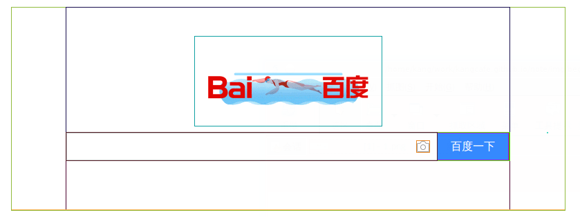
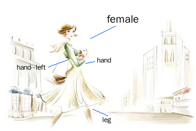

# BEM

<!-- toc -->

 当我们构建一个小的web应用的时候，怎样合理的组织页面样式并不是一个大的问题，而一但web应用体量逐渐增大的时候，就需要一定的规范和技巧来减少大的应用开发过程中`front-end developers`和`back-end developers`的联调消耗，应对这种场景由此产生了SMACSS[^^smacss_desc]、OOCSS[^^oocss_desc]以及BEM[^^bem_web_desc]等技术。

[^^smacss_desc]:[smacss](http://smacss.com/):SMACSS (pronounced “smacks”) is more style guide than rigid framework. There is no library within here for you to download or install. SMACSS is a way to examine your design process and as a way to fit those rigid frameworks into a flexible thought process. It is an attempt to document a consistent approach to site development when using CSS.

[^^oocss_desc]:[oocss](http://oocss.org/):In the OOCSS framework the media object describes a content block containing a fixed-size media element (e.g. image or video) along with other variable-size content (e.g. text). Another example is the module object, which describes a generic content block with a required body area and optional header and footer areas.The wiki is [Object Oriented CSS](https://github.com/stubbornella/oocss/wiki).

[^^bem_web_desc]:[bem](https://en.bem.info/):Frontend Development Methodology

> BEM Methodology will massively improve code maintainability and speed up the development process[^^BEM_Methodology_desc].

[^^BEM_Methodology_desc]:[Introduction To BEM Methodology](https://www.toptal.com/css/introduction-to-bem-methodology):What is BEM Methodology?

`BEM`是`Block`、`Element`和`Modifier`的缩写，其思想是通过模块化命名dom元素进行css样式的管理，以增强css和类名的可读性和易用性（所以这种命名方式只能用于classes而不能用于IDs）。

## Block

这里的`Block`是抽象的产物，按照[Josh Medeski](http://joshmedeski.com/)的说法：‘The block is the container or context where the element finds itself. [^^block_desc]’，[BEM](https://en.bem.info/)解释在整体web应用中任何一个模块都是一个对象，即`Block`（模块对象），每一个模块一一对应相应的css样式，比如一个简洁的[百度](https://www.baidu.com/)页面：

[^^block_desc]:[An Introduction to the BEM Methodology](http://webdesign.tutsplus.com/articles/an-introduction-to-the-bem-methodology--cms-19403):Block、Element、Modifiers.


将它的每一部分都进行边框线划分：



此时按照[BEM](https://en.bem.info/)的思想，每一个边框内的元素都是一个`Block`对象，彼此之间相互独立又存在相互嵌套。假设其中的某个`div`存在`.content`类名，中间嵌套`input`。

```html
<div class="content">
  <input type="text" class="search">
</div>
```

其css样式：

```css
.content {/* Styles */}
.search {/* Styles */}
```

看上去和我们平常组织的css样式写法并无区别，其中差异更多的是思想上的不同，也就是为下面`Element`和`Modifier`概念的引申进行铺垫。

## Element

这里我们期望`Element`代表一个功能性的事件元素，比如：

```html
<div class="content__section">
  <input type="text" class="search__input">
</div>
```

其css样式：

```css
.content__section {/* Styles */}
.search__input {/* Styles */}
```

## Modifier

`Modifier`用于修饰，

```html
<div class="content__section--featured">
  <input type="text" class="search__input--icon">
</div>
```

其css样式：

```css
.content__section--featured {/* Styles */}
.search__input--icon {/* Styles */}
```

## 约定

`Block`命名通常应用常见的`.content`、`.header`、`.footer`、`.sidebar`、`.area`等，有时可能我们期望`Block`的命名能够更长且详尽一些，如`.content`变为`.content-box`，即约定可以用`-`来延长`Block`。

```css
.content-box {/* Styles */}
```

`Block`与`Element`之间连接用`__`，或者说每一个`Element`都是由`__`开始的。

```css
.content__section {/* Styles */}
```

`Block`与`Modifier`之间连接用`--`，如`section--featured`。另一个约定的规范是用`_`进行连接，如`section_featured`。

```css
.section--featured {/* Styles */}
```

通常我们在一个div的`.header`标签里可能添加了需要修饰的`.header--fix`，但是不是所有的`.header`功能性类模块都要进行`.header--fix`处理，所以最好如下：

```html
<div class="header header--fix">
  <!-- html -->
</div>
```

[BEM](https://en.bem.info/)的命名替换方案有[Harry Roberts style](http://csswizardry.com/2013/01/mindbemding-getting-your-head-round-bem-syntax/)和[CamelCase style](http://csswizardry.com/2010/12/css-camel-case-seriously-sucks/)

Harry Roberts style示例：

```css
.block-name__element-name--modifier-name {/* Styles */}
```

约定规范的原文如下：

> - Names are written in lowercase
> - Words within the names of BEM entities are separated by a hyphen -
> - An element name is separated from a block name by a double underscore __
> - Boolean modifiers are delimited by double hyphens --
> - Key-value type modifiers are not used

CamelCase style示例：

```css
.BlockName__ElementName_ModifierName {/* Styles */}
```

## 实践

在我所阅读的`《How to Use BEM Methodology》`一文中有张图片形象的展示了如何应用`BEM`技术构建合理规范的UI，并列举了`XML`→`JSON`→`HTML`之间的对应关系。


XML：

```xml
<block:header>
  <block:logo/>
  <block:search-from>
    <block:input/>
    <block:button/>
  </block>
  <block:lang-switcher/>
</block>
```

JSON：

```json
{
  block: 'header',
  content: [
    { block: 'logo' },
    {
      block: 'search-form',
      content: [
        { block: 'input' },
        { block: 'button' }
      ]
    },
    { block: 'lang-switcher' }
  ]
}
```

HTML：

```html
<header class=”header”>
  
  <form class=”header__search-from”>
    <input class=”header__search-from__input” type=”input”>
    <button class=”header__search-from__button” type=”button”>
  </form>
  <div class=”header__lang-switcher”></div>
</header>
```

从图中我们可以看出BEM更倾向于`模块对象（Block）`和`语义化`，但这里其实也是有争议的，比如`Thierry Koblentz`就提出：'If you check the W3C's "[Tips for Webmasters](https://www.w3.org/QA/Tips/goodclassnames)" ,where it says "Good names don't change," you'll see that the argument is about maintenance, not semantics per se[^^challenging_css_best_practices_atomic_approach]'的论证观点用于阐述HTML标签的类名不应该过分强调语义化。

[^^challenging_css_best_practices_atomic_approach]:[Challenging CSS Best Practices](https://www.smashingmagazine.com/2013/10/challenging-css-best-practices-atomic-approach/#regarding-unsemantic-class-names):REGARDING UNSEMANTIC CLASS NAMES.

`TOMISLAV MATIJEVIĆ`对于BEM有一个形象的比喻，他将一个`Block`看作是一个人（person）。


人具有身体部位和不同性别，这里假定描述一个女生（female）的手部（hand）、腿部（leg）和左手（hand-left）。



用SASS描述CSS：

```scss
.person {
  &__hand {/* Styles */}
  &__leg {/* Styles */}
  &--female {
    /* Styles */
    &__hand {
      /* Styles */
      &--left {/* Styles */}
    }
    &__leg {/* Styles */}
  }
}
```

如果想更快速的书写样式，`TOMISLAV MATIJEVIĆ`集成了SASS书写BEM的方法：

```scss
// Block Element
// @param {String} $element - Element's name
@mixin element($element) {
    &__#{$element} {
        @content;
    }
}
// Block Modifier
// @param {String} $modifier - Modifier's name
@mixin modifier($modifier) {
    &--#{$modifier} {
        @content;
    }
}
.person {
  @include element('hand') {/* Person hand */}
  @include element('leg') {/* Person leg */}
  @include modifier('female') {
    /* Person female */
    @include element('hand') {
      /* Person female hand */
      @include modifier('left') {
        /* Person female left hand */
      }
    }
  }
}
```

输出效果：

```css
.person__hand {/* Person hand */}
.person__leg {/* Person leg */}
.person--female {/* Person female */}
.person--female__hand {/* Person female hand */}
.person--female__hand--left {/* Person female left hand */}
```

## 构建BEM

构建需要使用[ENB](https://en.bem.info/toolbox/enb/)，具体方法官网上也有详尽描述：[Starting your own BEM project](https://en.bem.info/platform/tutorials/start-with-project-stub/)。

## CssReset

|         |       |      |
| :------------- |:------------- |:------------- |
| Normalize.css[^^normalize_css_desc] | CSS Tools[^^css_tools_desc]| aliceui[^^aliceui_desc]|

具体的css reset选择可以阅读[John W. Long](http://wiseheartdesign.com/)的Modular CSS typography[^^modular_css_tyog_desc]，也许可以提供一些灵感。

[^^normalize_css_desc]:[Normalize.css](http://necolas.github.io/normalize.css/)

[^^css_tools_desc]:[CSS Tools](http://meyerweb.com/eric/tools/css/reset/)

[^^modular_css_tyog_desc]:[Modular CSS typography](http://thesassway.com/advanced/modular-css-typography)

[^^aliceui_desc]:[Alice](https://github.com/aliceui/aliceui.github.io):支付宝前端样式。

## 参考

- [A New Front-End Methodology: BEM](https://www.smashingmagazine.com/2012/04/a-new-front-end-methodology-bem/)
- [xjst](https://github.com/veged/xjst)
- [A BEM syntax with UX in mind](http://montagestudio.com/blog/2013/10/24/BEM-syntax-with-ux-in-mind/)
- [Yandex BEM/OOCSS](http://docs.emmet.io/filters/bem/)
- [MindBEMding – getting your head ’round BEM syntax](http://csswizardry.com/2013/01/mindbemding-getting-your-head-round-bem-syntax/)
