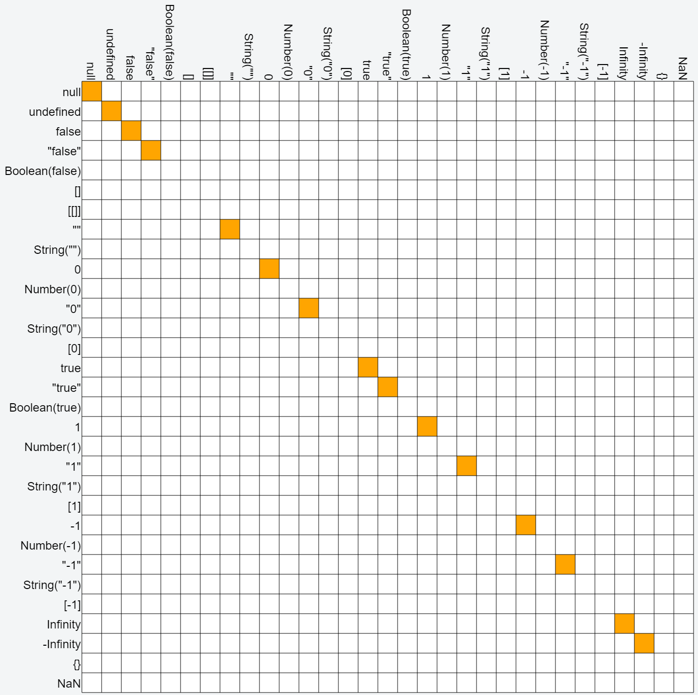

# 运算符

<!-- toc -->

## 赋值运算符

| 符号 | 实例 |
|--------|--------|
| = |var = exp|


## 算术运算符

| 符号 | 实例 |
|--------|--------|
| \+ |exp1 \+ exp2|
|\-|exp1 \- exp2|
|\*|exp1 \* exp2|
|/|exp1 / exp2|
|%|exp1 % exp2|
|\+\+|var\+\+|
|\+\+|\+\+var|
|\-\-|var\-\-|
|\-\-|\-\-var|

`var++`递增运算符是先执行赋值运算，然后再执行递加运算。

```js
var n = 4,
	b = n++;
console.log(n);
console.log(b);
==> 5
==> 4
```

`++var`递增运算符是先执行递加运算，再进行赋值运算。

```js
var n = 4,
	b = ++n;
console.log(n);
console.log(b);
==> 5
==> 5
```

## 关系运算符

| 符号 | 实例 |
|--------|--------|
| == |exp1 == exp2|
| != |exp1 != exp2|
| < |exp1 < exp2|
| <= |exp1 <= exp2|
| > |exp1 > exp2|
| >= |exp1 >= exp2|
| === |exp1 === exp2|
| !== | exp1 !== exp2|

== 运算符与 != 运算符都会自动转换类型进行判断，而 === 运算符与 !== 运算符则不进行自动转换。

== 强制转换运算数类型的转换规则：

```js
console.log('' == '0');
console.log(0 == '');
console.log(0 == '0');
console.log(false == 'false');
console.log(false == '0');
console.log(false == undefined);
console.log(false == null);
console.log(null == undefined);
==> false
==> true
==> true
==> false
==> true
==> false
==> false
==> true
```

关于`==`运算符的速查表：


关于`===`运算符的速查表：



综合速查表：

- 红色：===
- 橙色：==
- 黄色：<= 和 >= 同时成立，== 不成立
- 蓝色：只有 >=
- 绿色：只有 <=


## 逻辑运算符

| 符号 | 实例 |
|--------|--------|
| && | exp1 && exp2 |
|&#124;&#124;| exp1 &#124;&#124; exp2 |
|\!| \!exp1|

逻辑运算符`&&`、`||`和位运算符`&`、`|`的区别：

逻辑运算符`&&`、`||`中，如果`&&`的第一个运算数是false，就不再考虑第二个运算数，直接返回false，同理`||`的第一个运算数是true，也不再考虑第二个运算数，直接返回true。而`&`、`|`运算符需要进行逐位运算，比较两个运算数才得出结果，因而性能上`&&`、`||`会比`&`、`|`好。`&`、`|`本是位运算符，之所以可以进行"逻辑运算"，是由于JS是无类型的语言、各数据类型可以自由转换这一特性决定的，当用`&`、`|`进行"逻辑运算"时，实际上true被转换成1，false被转换成0，再进行逐位运算：

```js
console.log(true & false);
==> 0
console.log(1 & 0);
==> 0
```

### 逻辑与运算：

| 第一个操作数 | 第二个操作数 | 结果 |
|--------|--------|--------|
| true | true | true |
| true | false | false |
| false | true | false |
| false | false | false |

如果两边的操作数有一个操作数不是布尔值的情况下，与运算符就不一定返回布尔值，此时，遵循以下规则：

 1. 第一个操作数是对象，则返回第二个操作数
 2. 第二个操作数是对象，则第一个操作数返回true，才返回第二个操作数，否则返回false；
 3. 有一个操作数是null，则返回null；
 4. 有一个操作数是undefined，则返回undefined。

```js
console.log('对象' && (5>4));
console.log((5>4) && '对象');
console.log((3>4) && '对象');
console.log((5>4) && null);
==> true
==> 对象
==> false
==> null
```

### 逻辑或运算

| 第一个操作数 | 第二个操作数 | 结果 |
|--------|--------|--------|
| true | true | true |
| true | false | true |
| false | true | true |
| false | false | false |

与逻辑与操作相似，如果有一个操作数不是布尔值，逻辑或也不一定返回布尔值；此时，它遵循下列规则：

1. 如果第一个操作数是对象，则返回第一个操作数。
2. 如果第一个操作数求值为false，则返回第二个操作数。
3. 如果两个操作数都是对象，则返回第一个操作数。
4. 如果两个操作数都是null，返回null
5. 如果两都为`undefined`，返`undefined`。
6. 如果两都为`NaN`，返`NaN`

```js
console.log('对象' || (5>3));
console.log((5>3) || '对象');
console.log('对象1' || '对象2');
console.log(null || null);
console.log(NaN || NaN);
console.log(undefined || undefined);
console.log(null || NaN);
console.log(undefined || NaN);
console.log(null || undefined);
console.log(undefined || null);
console.log(NaN || null);
==> 对象
==> true
==> 对象1
==> null
==> NaN
==> undefined
==> NaN
==> NaN
==> undefined
==> null
==> null
```

参考：

- [Logical Operators](https://developer.mozilla.org/en-US/docs/Web/JavaScript/Reference/Operators/Logical_Operators)


## 条件运算符

| 符号 | 实例 |
|--------|--------|
| ? : | exp1 ? exp2 : exp3 |

## 逗号运算符

| 符号 | 实例 |
|--------|--------|
| , | exp1, exp2 |

逗号运算符示例：

```js
var param = 1, 2, 3, 4;
console.log(param);
==> Uncaught SyntaxError: Unexpected number(…)
console.log(param = 1, 2, 3, 4);
console.log(param);
==> 4
==> 1
```


## 位运算符

| 符号 | 实例 |
|--------|--------|
| & |  exp1 & exp2 |
| &#124; | exp1 &#124; exp2 |
| ^ | exp1 ^ exp2 |
| ~ | ~exp1 |
| << | exp1 << exp2 |
| >> |  exp1 >> exp2 |
| >>> | exp1 >>> exp2 |

```js
console.log(~~true == 1);
console.log(~~false == 0);
console.log(~~"" == 0);
console.log(~~[] == 0);
console.log(~~undefined ==0);
console.log(~~!undefined == 1);
console.log(~~null == 0);
console.log(~~!null == 1);
console.log(~[]);
console.log(~~[]);
==> true
==> true
==> true
==> true
==> true
==> true
==> true
==> true
==> -1
==> 0
```


```js
console.log(0x87654321 & 0xffff0000);
console.log(0x87654321 | 0xffff0000);
console.log(0xffff0000 ^ 0xff00ff00);
console.log(~0xffff0000);
==> -2023424000
==> -48351
==> 16776960
==> 65535
```
巧用`&`、`|`进行逻辑运算：

```js
/**执行次数的奇偶**/
for(var i=0;i<=4;i++){
	i & 1?console.log('i='+i+',奇数'):console.log('i='+i+',偶数');
}
==> i=0,偶数
==> i=1,奇数
==> i=2,偶数
==> i=3,奇数
==> i=4,偶数
```

## 扩展赋值运算符

| 符号 | 实例 | 等价 |
|--------|--------|--------|
| += | var += exp | var = var + exp |
| \-= | var -= exp | var = var - exp |
| *= | var *= exp | var = var * exp |
| /= | var /= exp | var = var / exp |
| %= | var %= exp | var = var % exp |
| &= | var &= exp | var = var & exp |
| &#124;= | var &#124;= exp | var = var &#124; exp |
| ^= | var ^= exp | var = var ^ exp |
| <<= | var <<= exp | var = var << exp |
| >>= | var >>= exp | var = var >> exp |
| >>>= | var >>>= exp | var = var >>> exp |

## valueOf运算符

语法为`object.valueOf()`，返回指定对象的原始值。

JavaScript的许多内置对象都重写了该函数，以实现更适合自身的功能需要。因此，不同类型对象的valueOf()方法的返回值和返回值类型均可能不同。

| 对象 | 返回值 |
|--------|--------|
|Array|数组实例对象|
|Boolean|布尔值|
|Date|以毫秒数存储的时间值，从 UTC 1970 年 1 月 1 日午夜开始计算|
|Function|函数本身|
|Number|数字值|
|Object|对象本身。这是默认设置|
|String|字符串值|

```js
var arr = ["Code", true, 12, -5];
console.log(arr.valueOf() === arr);
console.log(true.valueOf() === true);
var newBool = new Boolean(true);
console.log(newBool.valueOf() == newBool);
console.log(newBool.valueOf() === newBool);
console.log(new Date(2013, 7, 18, 23, 11, 59, 230).valueOf());
function foo(){}
console.log(foo.valueOf() === foo);
var foo2 =  new Function("x", "y", "return x + y;");
console.log( foo2.valueOf() === foo2 );
var num =  15.26540;
console.log(num.valueOf());
console.log();
var obj = {name: "张三", age: 18};
console.log(obj.valueOf() === obj);
var str = "http://kangcafe.com";
console.log(str.valueOf() === str);
var str2 = new String("http://kangcafe.com");
console.log(str2.valueOf() === str2);
==> true
==> true
==> true
==> false
==> 1376838719230
==> true
==> true
==> 15.2654
==> true
==> true
==> false
```

## 运算符的优先级

<table class=p border=1 cellspacing=0 cellpadding=3 width="85%">
<tr class=h><th>优先级</th><th>运算符</th></tr>
<tr><th rowspan=15 class=h><div>↑</div><div>高</div><br><br><br><div>低</div><div>↓</div></th>
<td>数组（[]） 括号（( )）</td></tr>
<tr><td>増減（++ --） 负号（-） 取反（~） NOT（!）</td></tr>
<tr><td>乘除余（* / %）</td></tr>
<tr><td>加减（+ -) 连接字符串（+）</td></tr>
<tr><td>位移（&lt;&lt; &gt;&gt; &lt;&lt;&lt;）</td></tr>
<tr><td>比较（&lt; &lt;= &gt;= &gt;）</td></tr>
<tr><td>比较（== != === !==）</td></tr>
<tr><td>AND（&amp;）</td></tr>
<tr><td>XOR（^）</td></tr>
<tr><td>OR（|）</td></tr>
<tr><td>且（&amp;&amp;）</td></tr>
<tr><td>或（||）</td></tr>
<tr><td>条件（? :）</td></tr>
<tr><td>赋值（=） 扩展赋值（+=等）</td></tr>
<tr><td>逗号（,）</td></tr>
</table>


## 运算符重载

运算符重载，就是对已有的运算符重新进行定义，赋予其另一种功能，以适应不同的数据类型。
